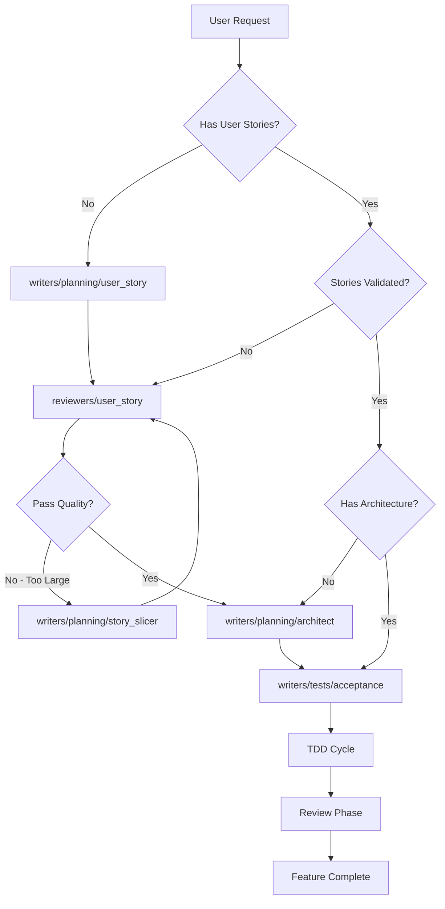

# Agent Catalog

This directory contains specialized agents for implementing features following Pedro's Algorithm with hexagonal architecture and DDD patterns.

## 🎯 Getting Started

### Quick Start

1. **Read the [orchestrator.md](orchestrator.md)** - The orchestrator coordinates all agents and determines your workflow entry point
2. **Identify your starting point** - See "Entry Points" section below
3. **Follow the orchestrator's guidance** - It will tell you which agents to use and when
4. **Let agents do the work** - Each agent is an expert in its domain

### How to Use This System

The agent system follows a **conductor-orchestra model**:

- **🎼 Orchestrator** = The conductor who coordinates everything
- **🎻 Agents** = The musicians, each expert in their instrument

**You interact with the ORCHESTRATOR, not individual agents directly.**

The orchestrator will:
1. Assess what you have (requirements, stories, architecture, etc.)
2. Determine the correct entry point
3. Invoke the appropriate agents in the right sequence
4. Ensure quality gates are met
5. Guide you through Pedro's Algorithm (Outside-In TDD)

### Entry Points Assessment

**Start by telling the orchestrator what you have:**

| You Have                      | Orchestrator Starts At                       | Skips                        |
| ----------------------------- | -------------------------------------------- | ---------------------------- |
| Raw business requirements     | `writers/planning/user_story`                | None                         |
| Written user stories          | `reviewers/user_story`                       | User story writing           |
| Validated user stories        | `writers/planning/architect`                 | Story writing & review       |
| Architecture plan ready       | `writers/tests/acceptance`                   | All planning phases          |
| Acceptance test written       | TDD implementation cycle                     | Planning & acceptance test   |

**Example conversation starters:**

```
"I need to implement user registration with email confirmation"
→ Orchestrator: No stories, starts at writers/planning/user_story

"I have this user story: 'As a user, I want to...'"
→ Orchestrator: Has story, starts at reviewers/user_story

"I have a validated story and architecture plan ready"
→ Orchestrator: Ready to implement, starts at writers/tests/acceptance
```

## 📋 Agent Organization

### 📝 Writers (`/writers/`)

#### Planning (`/writers/planning/`)

| Agent                                            | Purpose                                            | When to Use                  |
| ------------------------------------------------ | -------------------------------------------------- | ---------------------------- |
| [user_story](writers/planning/user_story.md)     | Creates user stories from business requirements    | No user stories exist        |
| [story_slicer](writers/planning/story_slicer.md) | Breaks large stories into vertical slices          | Stories too large (>5 days)  |
| [architect](writers/planning/architect.md)       | Plans architecture (aggregates, ports, CQRS split) | Before implementation starts |

#### Tests (`/writers/tests/`)

| Agent                                       | Purpose                                                | When to Use                        |
| ------------------------------------------- | ------------------------------------------------------ | ---------------------------------- |
| [acceptance](writers/tests/acceptance.md)   | Writes failing acceptance tests for complete use cases | Start of TDD cycle                 |
| [unit](writers/tests/unit.md)               | Writes failing unit tests for individual components    | Inside TDD red-green-refactor loop |
| [integration](writers/tests/integration.md) | Tests driven adapters with real external systems       | After repositories implemented     |
| [contract](writers/tests/contract.md)       | Tests driving adapters for API contract compliance     | After controllers implemented      |
| [e2e](writers/tests/e2e.md)                 | Tests complete system with real infrastructure         | Optional - full system validation  |

#### Domain (`/writers/domain/`)

| Agent                                              | Purpose                                                        | When to Use                        |
| -------------------------------------------------- | -------------------------------------------------------------- | ---------------------------------- |
| [aggregate](writers/domain/aggregate.md)           | Implements domain aggregates (root + entities + value objects) | Unit test requires domain behavior |
| [domain_service](writers/domain/domain_service.md) | Implements cross-aggregate business logic                      | Logic spans multiple aggregates    |
| [events](writers/domain/events.md)                 | Implements domain events for state changes                     | Need to notify other contexts      |

#### Application (`/writers/application/`)

| Agent                                     | Purpose                                             | When to Use                   |
| ----------------------------------------- | --------------------------------------------------- | ----------------------------- |
| [command](writers/application/command.md) | Implements CQRS command handlers (write operations) | Need write operation use case |
| [query](writers/application/query.md)     | Implements CQRS query handlers (read operations)    | Need read operation use case  |

#### Infrastructure (`/writers/infrastructure/`)

| Agent                                                                  | Purpose                                       | When to Use                       |
| ---------------------------------------------------------------------- | --------------------------------------------- | --------------------------------- |
| [repository_interface](writers/infrastructure/repository_interface.md) | Designs repository interfaces in domain layer | Before repository implementation  |
| [repository](writers/infrastructure/repository.md)                     | Implements database-specific repositories     | After integration tests written   |
| [migration](writers/infrastructure/migration.md)                       | Creates database schema migrations            | Schema changes needed             |
| [controller](writers/infrastructure/controller.md)                     | Implements HTTP controllers and CLI handlers  | After contract tests written      |
| [external_adapter](writers/infrastructure/external_adapter.md)         | Implements adapters for external APIs         | Integration with external systems |

#### Utilities (`/writers/utilities/`)

| Agent                                               | Purpose                           | When to Use                         |
| --------------------------------------------------- | --------------------------------- | ----------------------------------- |
| [dto](writers/utilities/dto.md)                     | Generates data transfer objects   | API request/response objects needed |
| [id_generator](writers/utilities/id_generator.md)   | Implements ID generation adapters | Custom ID generation strategy       |
| [time_provider](writers/utilities/time_provider.md) | Implements time provider adapters | Testable time operations needed     |

### 🔍 Reviewers (`/reviewers/`)

| Agent                                 | Purpose                                                    | When to Use                     |
| ------------------------------------- | ---------------------------------------------------------- | ------------------------------- |
| [user_story](reviewers/user_story.md) | Validates story quality (INVEST criteria, domain concepts) | Stories need quality validation |
| [test](reviewers/test.md)             | Validates test taxonomy and mock discipline                | Before final commit             |
| [code](reviewers/code.md)             | Reviews code against RULES.md patterns                     | Before final commit             |
| [hexagonal](reviewers/hexagonal.md)   | Validates hexagonal architecture boundaries                | Before final commit             |
| [cqrs](reviewers/cqrs.md)             | Validates CQRS pattern compliance                          | Before final commit             |
| [ddd](reviewers/ddd.md)               | Validates DDD tactical pattern usage                       | Before final commit             |

## 🔄 Complete Workflow Example

### Scenario: Implementing User Registration

**Step 1: You tell the orchestrator what you need**
```
You: "I need to implement user registration with email confirmation"
```

**Step 2: Orchestrator assesses and plans**
```
Orchestrator Assessment:
- No user stories exist
- Entry Point: writers/planning/user_story
- Workflow: Planning → TDD → Review
```

**Step 3: Orchestrator invokes planning agents**
```
1. writers/planning/user_story
   Input: "user registration with email confirmation"
   Output: User story with acceptance criteria

2. reviewers/user_story
   Output: ❌ Quality Score: 73% - Story too large (8 days)

3. writers/planning/story_slicer
   Output:
   - Slice 1: "Register user with validated credentials"
   - Slice 2: "Send email confirmation after registration"

4. reviewers/user_story (validate slices)
   Output: ✅ Both slices pass (90%+ score)

5. writers/planning/architect (for Slice 1)
   Output: Architecture plan with aggregates, ports, CQRS split
```

**Step 4: Orchestrator runs TDD cycle (for each slice)**
```
6. writers/tests/acceptance (RED)
   Output: test_register_user_acceptance() - FAILS

7. LOOP while acceptance test RED:
   a. writers/tests/unit (RED)
      Output: test_email_validates_format() - FAILS

   b. writers/domain/aggregate
      Output: Email value object with validation
      Tests: GREEN ✅
      Commit: "[BEHAVIORAL] Add Email value object"

   c. writers/tests/unit (RED)
      Output: test_user_creation() - FAILS

   d. writers/domain/aggregate
      Output: User aggregate
      Tests: GREEN ✅
      Commit: "[BEHAVIORAL] Add User aggregate"

   e. writers/tests/unit (RED)
      Output: test_register_user_use_case() - FAILS

   f. writers/application/command
      Output: RegisterUserUseCase
      Tests: GREEN ✅ (Acceptance test now GREEN!)
      Commit: "[BEHAVIORAL] Add RegisterUserUseCase"

8. writers/tests/integration
   Output: test_postgres_user_repository_integration()

9. writers/infrastructure/repository
   Output: PostgresUserRepository
   Tests: GREEN ✅
   Commit: "[BEHAVIORAL] Add PostgresUserRepository"

10. writers/tests/contract
    Output: test_register_endpoint_contract()

11. writers/infrastructure/controller
    Output: RegisterUserController
    Tests: GREEN ✅
    Commit: "[BEHAVIORAL] Add RegisterUserController"
```

**Step 5: Orchestrator runs review phase**
```
12. reviewers/test → ✅ All tests properly classified
13. reviewers/code → ✅ RULES.md compliant
14. reviewers/hexagonal → ✅ Clean architecture boundaries
15. reviewers/cqrs → ✅ Command goes through domain
16. reviewers/ddd → ✅ Proper aggregate design

Final Commit: "[FEATURE] User registration - Slice 1 COMPLETE"
```

**Step 6: Repeat for Slice 2**
```
Orchestrator: "Slice 1 complete. Ready for Slice 2?"
You: "Yes, continue"
Orchestrator: Repeats steps 5-16 for email confirmation slice
```

## 🎓 How the Orchestrator Works

### Orchestrator's Decision Process



### The Orchestrator Never:

❌ Skips required steps
❌ Allows commits on RED tests
❌ Mixes structural and behavioral changes
❌ Lets acceptance tests pass too early
❌ Forgets to run review agents

### The Orchestrator Always:

✅ Validates quality gates
✅ Maintains proper agent sequence
✅ Enforces Pedro's Algorithm
✅ Ensures clean architecture
✅ Tracks acceptance test status (RED → GREEN)

## 📖 Usage Guidelines

### Working with the Orchestrator

**DO:**
- ✅ Tell orchestrator your starting point clearly
- ✅ Trust the orchestrator's agent selection
- ✅ Follow the recommended sequence
- ✅ Wait for quality gates before proceeding
- ✅ Commit on GREEN as orchestrator instructs

**DON'T:**
- ❌ Skip agents the orchestrator recommends
- ❌ Jump ahead in the sequence
- ❌ Commit before all tests GREEN
- ❌ Mix planning and implementation phases
- ❌ Ignore review agent feedback

### Understanding Agent Boundaries

Each agent has a **specific expertise**:

| Agent Type       | Knows About                              | Doesn't Know About              |
| ---------------- | ---------------------------------------- | ------------------------------- |
| Planning Agents  | Stories, slicing, architecture design    | Code implementation, testing    |
| Test Agents      | Test taxonomy, mocking, test boundaries  | Business logic, architecture    |
| Domain Agents    | Business rules, aggregates, DDD patterns | Databases, HTTP, external APIs  |
| Infra Agents     | Repositories, controllers, adapters      | Business logic, domain rules    |
| Review Agents    | Quality gates, pattern compliance        | Implementation details          |

**The orchestrator knows ALL boundaries and coordinates properly.**

### Agent Communication Flow

```
You
 ↓
Orchestrator (reads what you have, decides entry point)
 ↓
Planning Agents (create/validate stories, design architecture)
 ↓
Test Agents (write failing tests - RED)
 ↓
Implementation Agents (make tests pass - GREEN)
 ↓
Review Agents (validate quality)
 ↓
Orchestrator (final approval, instructs commit)
 ↓
Feature Complete! ✅
```

### Quality Gates

**User Story Quality:**
- Must score 85%+ on INVEST criteria
- Must identify domain concepts clearly
- Must have testable acceptance criteria

**Code Quality:**
- All tests GREEN before commits
- No linter/compiler warnings
- Proper test taxonomy (no misclassified tests)
- Mock discipline followed (adapters only, not domain)

**Architecture Quality:**
- Clean hexagonal boundaries
- One repository per aggregate
- CQRS properly separated
- DDD tactical patterns correct

### Common Patterns

**Repository Pattern:**
- Use `writers/infrastructure/repository_interface` for domain port
- Use `writers/infrastructure/repository` for implementation
- One repository per aggregate root only

**CQRS Pattern:**
- Commands: Use `writers/application/command` (goes through domain)
- Queries: Use `writers/application/query` (bypasses domain)
- Never mix command and query in same handler

**Test Strategy:**
- Acceptance: Complete use case with fakes/mocks for ALL adapters
- Unit: Single component with mocks for driven ports only
- Integration: Real external systems (no mocks at boundary)
- Contract: API layer only (HTTP status, validation)

**Mock Discipline:**
- ✅ Mock: Repositories, external services, infrastructure ports
- ❌ Never mock: Domain entities, value objects, aggregates, domain services

## 🎯 Success Indicators

**You're doing it right when:**

- ✅ Orchestrator determines your entry point (you don't guess)
- ✅ Acceptance test stays RED until complete feature implemented
- ✅ Each unit test → implementation → commit cycle is small and focused
- ✅ Clean commits on every green cycle
- ✅ All review agents pass before final commit
- ✅ Each slice delivers real business value
- ✅ Tests survive refactoring (not coupled to implementation)

**Red flags that orchestrator will catch:**

- 🚫 Unit tests mislabeled as "acceptance tests"
- 🚫 Committing while tests are RED
- 🚫 Mocking domain objects (entities, value objects)
- 🚫 Verifying query method calls (find, get)
- 🚫 Mixing structural and behavioral changes
- 🚫 Skipping quality gates
- 🚫 Making acceptance test pass prematurely

## 🔧 Practical Tips

### Getting the Most from the Orchestrator

**1. Be explicit about your starting point:**
```
❌ "Help me with user registration"
✅ "I have a user story for registration. I need architecture planning."
```

**2. Trust the orchestrator's sequence:**
```
❌ "Skip the acceptance test, I'll write it later"
✅ "Orchestrator says write acceptance test first, so let's do that"
```

**3. Let agents do their job:**
```
❌ "I'll write the repository, then you review it"
✅ "Orchestrator: invoke writers/infrastructure/repository"
```

**4. Respect quality gates:**
```
❌ "The test is mostly passing, good enough"
✅ "All tests must be GREEN before commit"
```

### Debugging Agent Issues

**If an agent produces unexpected output:**

1. Check you're at the right workflow stage
2. Verify the agent received correct input
3. Ensure prerequisites are met (e.g., architecture plan before tests)
4. Ask orchestrator to reassess entry point

**If tests are failing:**

1. Orchestrator will identify which agent to invoke next
2. Follow RED → GREEN → REFACTOR cycle strictly
3. Don't skip agents to "speed up"
4. Each test should test ONE thing

**If quality gates fail:**

1. Review agents will identify specific issues
2. Fix issues before proceeding
3. Re-run review agents to verify
4. Don't override review agent recommendations

## 🔗 Related Documentation

**Essential Reading:**
- [orchestrator.md](orchestrator.md) - **START HERE** - How agents coordinate
- [RULES.md](../RULES.md) - Complete DDD & hexagonal architecture rules
- [CLAUDE.md](../CLAUDE.md) - Comprehensive guidance for Claude Code

**Quick References:**
- [AI_PROMPT_TEMPLATE.md](../AI_PROMPT_TEMPLATE.md) - Quick patterns and examples
- Individual agent files - Detailed instructions for each agent

**Learning Path:**
1. Read `orchestrator.md` to understand workflow
2. Review `RULES.md` for architecture patterns
3. Examine individual agent files as needed
4. Practice with complete examples in `CLAUDE.md`

## 📞 Quick Reference Card

```
┌─────────────────────────────────────────────────────────────┐
│ ORCHESTRATOR AGENT SYSTEM - QUICK REFERENCE                 │
├─────────────────────────────────────────────────────────────┤
│                                                             │
│ ENTRY POINTS:                                               │
│ • No stories      → writers/planning/user_story             │
│ • Have stories    → reviewers/user_story                    │
│ • Validated       → writers/planning/architect              │
│ • Have plan       → writers/tests/acceptance                │
│                                                             │
│ TDD CYCLE:                                                  │
│ 1. Acceptance test (RED)                                    │
│ 2. Unit test (RED) → Implement (GREEN) → Commit            │
│ 3. Repeat until acceptance GREEN                            │
│ 4. Integration tests                                        │
│ 5. Contract tests                                           │
│ 6. Review agents                                            │
│                                                             │
│ COMMIT RULES:                                               │
│ • Only on GREEN                                             │
│ • Small, frequent commits                                   │
│ • Clear messages (BEHAVIORAL vs STRUCTURAL)                 │
│                                                             │
│ MOCK DISCIPLINE:                                            │
│ • ✅ Mock: Repositories, external services, infrastructure  │
│ • ❌ Never: Domain entities, value objects, aggregates      │
│ • ✅ Verify: Commands (save, send, publish)                 │
│ • ❌ Never verify: Queries (find, get)                      │
│                                                             │
│ QUALITY GATES:                                              │
│ • Story: 85%+ INVEST score                                  │
│ • Code: All tests GREEN, no warnings                        │
│ • Architecture: Clean boundaries, proper patterns           │
│                                                             │
└─────────────────────────────────────────────────────────────┘
```

---

## 💡 Remember

**The orchestrator is your guide through Pedro's Algorithm.**

- You provide the **what** (requirements, stories, goals)
- Orchestrator determines the **how** (sequence, agents, quality)
- Agents execute the **work** (tests, code, review)
- You get **working, tested, quality software** following best practices

**Trust the process. Follow the orchestrator. Let the agents work.**
